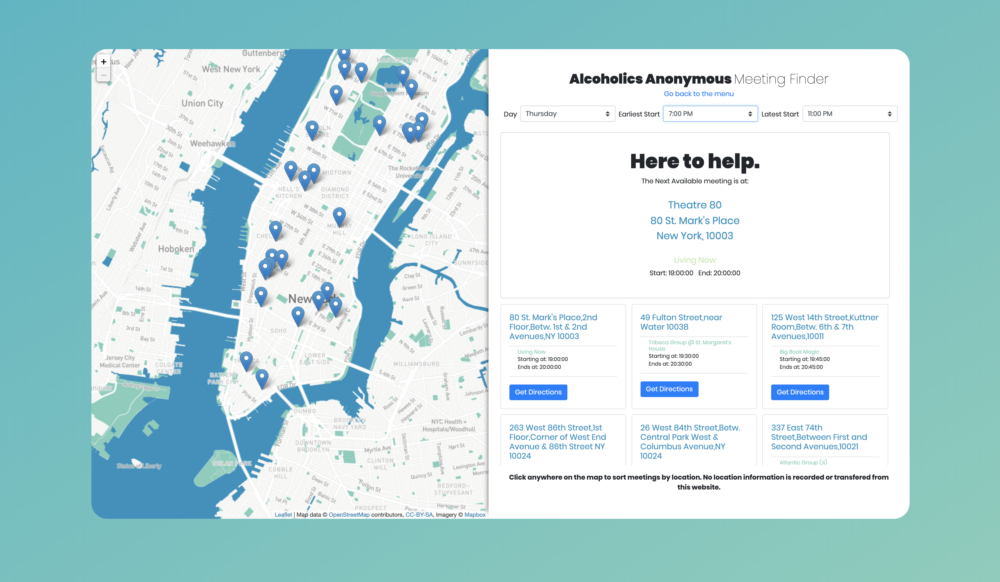

## Final Assignment 1
# Alcoholics Anonymous

Details of the Assignment can be found [here](https://github.com/visualizedata/data-structures/blob/master/final_assignment_1.md).  

Details of the process building up to the final assignment can be found in the 
[Week1](https://github.com/neil-oliver/data-structures/tree/master/week01), 
[Week2](https://github.com/neil-oliver/data-structures/tree/master/week02), 
[Week3](https://github.com/neil-oliver/data-structures/tree/master/week03), 
[Week4](https://github.com/neil-oliver/data-structures/tree/master/week04), 
[Week6](https://github.com/neil-oliver/data-structures/tree/master/week06), 
[Week7](https://github.com/neil-oliver/data-structures/tree/master/week07), 
[Week10](https://github.com/neil-oliver/data-structures/tree/master/week10) & 
[Week11](https://github.com/neil-oliver/data-structures/tree/master/week11) Folders. 


  
## Endpoints
An endpoint was created using node express but is not directly accessed by the user.
The user is served a static HTML page and an AJAX call is made using JQuery to request data from the endpoint. 
```javascript
function getResults(){
    
    $.get( '/aa',parameters, function(data) {
    ...
    });
}

function init(){
    getResults()
}
```
The settings from the selection options (earliest start time, latest start time and day) are sent to the server as part of the AJAX call.
```javascript
var parameters = { day: $('select[name="day"]').val(), after: $('select[name="after"]').val(), before: $('select[name="before"]').val() };
$.get( '/aa',parameters, function(data) {
 ...   
})
```
The response from the endpoint contains both HTML formatted data (via handlebars) and JSON data.
This information is then loaded into the HTML using jQuery and used to create markers for the map.
```javascript
// the return data (hanlebars html) is added to the meetings DIV.
$('#meetings').html(data[0])

markers.clearLayers();

// loop through the JSON data and add markers to the map
for (var i=0; i<data[1].length; i++) {
    var popupText = `<h1>${data[1][i].extended_address}</h1>`
    var divText = `<h1>${data[1][i].location_name}</h1><h1>${data[1][i].address_line_1}</h1><h1>New York, ${data[1][i].zipcode}</h1><br>`
    for (x in data[1][i].meeting){
        popupText += `<h2>${data[1][i].meeting[x].group}</h2>Start: ${data[1][i].meeting[x].start}<br>End: ${data[1][i].meeting[x].end}<br>`
        if (x == 0){
        divText += `<h2>${data[1][i].meeting[x].group}</h2>Start: ${data[1][i].meeting[x].start} &nbsp End: ${data[1][i].meeting[x].end}`
        }
    }
    L.marker( [data[1][i].lat, data[1][i].long] ).bindPopup(popupText).addTo(markers);
    
    if (i==0){
        // add the 'next available meeting details
        $('#next').html(divText)
    }
}

```
## Database & Query Design
Once the endpoint is called an asynchronous function is called to make a request to the database. 
The function is passed the parameters that were part of the AJAX call.
```javascript
app.get('/aa', async function (req, res) {
    if (req.query == {}){
        res.send(await aa());
    } else {
        res.send(await aa(req.query.after,req.query.before,req.query.day));
    }
});
```
Default values are in place so that if no variables are contained within the AJAX call, a default search can still be made.
```javascript
after = after || moment().format('LT');
before = before || "11:59 PM";
day = day || moment().format('dddd') + 's'; 
```
The parameters are then inseted into the query string and the query is made. 
```javascript
thisQuery = `SELECT locations.lat, locations.long, locations.Extended_Address, locations.Location_Name, locations.Address_Line_1, locations.Zipcode, json_agg(json_build_object('group', groups.Group_Name, 'start', events.Start_at, 'end', events.End_at)) as meeting 
FROM groups 
INNER JOIN locations ON groups.Location_ID=locations.Location_ID 
INNER JOIN events ON groups.Group_ID=events.Group_ID 
WHERE events.Day = '${day}' AND events.Start_at BETWEEN time '${after}' AND time '${before}' 
GROUP BY locations.lat, locations.long, locations.Extended_Address, locations.Location_Name, locations.Address_Line_1, locations.Zipcode;`
```
  
### Query Response
The query combines information from different tables nesting it to create locations that contain meetings that can have multiple events.
```javascript
address_line_1: "296 9th Avenue"
extended_address: "296 9th Avenue,2nd Floor,Corner of West 28th Street,NY 10001"
location_name: "Holy Apostles Church Rectory"
lat: 40.7493642017494
long: -73.9991233310954
zipcode: "10001"

meeting: Array(3)
0: {group: "Ninth Avenue           (:I)", start: "18:15:00", end: "19:15:00"}
1: {group: "Ninth Avenue           (:I)", start: "19:30:00", end: "20:45:00"}
2: {group: "Ninth Avenue           (:I)", start: "21:00:00", end: "22:00:00"}
```

### Handlebars
Once the query has completed, the handlebars module is used to format the response from the query into an array of HTML elements. 
Handlebars first loads an external file (with a .HTML extension to provide syntax highlighting during creation). 
```javascript
{{#meetings}}
  <div class="location card" data-latlon="{{lat}},{{long}}">
    <div class="card-body">
      <h1 class="card-title">{{extended_address}}</h1>
      <ul class="list-group list-group-flush">
        {{#meeting}}
          <li class="list-group-item">
            <h3 class="card-subtitle">{{group}}</h3>
            <div class="card-text">
              Starting at: {{start}}<br>
              Ends at: {{end}}<br>
            </div>
          </li>
        {{/meeting}}
      </ul><br>
      <a class='btn btn-primary' href='http://maps.google.com/?q={{lat}},{{long}}' target='_blank'>Get Directions</a>
    </div>
  </div>
{{/meetings}}
```
This file uses handlebar blocks to convert an array of JSON objects into an array of HTML elements.
Both the handlebars array and the JSON response from the query are returned to the endpoint to be returned to the browser.
```javascript
client.query(thisQuery, async (err, results) => {
    if(err){throw err}
    await fs.readFile('./aa-handlebars.html', 'utf8', (error, data) => {
        var template = handlebars.compile(data);
        output.meetings = results.rows;
        var html = template(output);
        resolve([html,results.rows]);
    });
    client.end();
});
```

## Frontend Design
### Default Views
On page load, the three selection boxes are set based on the current day, current time (moving forward in time to the next hour) and a static endpoint of ther start of the day.
```javascript
var days = ['Sundays','Mondays','Tuesdays','Wednesdays','Thursdays','Fridays','Saturdays'];
$(`select[name="day"]`).val(days[new Date().getDay()])


var currenthour = new Date().getHours()
if (currenthour>11){
    $(`select[name="after"]`).val(`${currenthour-11}:00 PM`)
} else {
    $(`select[name="after"]`).val(`${currenthour+1}:00 AM`)
}

$(`select[name="before"]`).val(`11:00 PM`)
```
When a user changes any of the selections, a new AJAX call is made to the server and the page is updated. 
```javascript
$(function(){
    $('select').change(function() {
        getResults()
    });
});
```
The next available meeting within the users time selection is displayed as a focal point in the center of the page.
### Get Directions
A link to google maps is provided for each meeting. The link uses the coordinates in order to keep a level of anonymity for the user.

### Map
A custom map type was made using mapbox studio to match the theme of the website.
The zoom values are fixed to allow people to zoom from seeing the majority of manhattan within their screen to being able to identify which block a meeting is on.


### Anonymous Sorting
To avoid asking for any personal details from the user, the user can click on any area of the map and the results reorder by distance from that point. 
The method requires no addtional loading or database calls, is equally as accurate as asking the user for an address (possible more accurate due to the dependence on third part location based services) and is faster for the user.
```javascript
function sortResults(position) {

    var latlon = new LatLon(position.lat, position.lng);
    
    var locations = document.getElementById('meetings');
    var locationList = locations.querySelectorAll('.location');
    var locationArray = Array.prototype.slice.call(locationList, 0);
    
    locationArray.sort(function(a,b){
      var locA  = a.getAttribute('data-latlon').split(',');
      var locB  = b.getAttribute('data-latlon').split(',');
    
      distA = latlon.distanceTo(new LatLon(Number(locA[0]),Number(locA[1])));
      distB = latlon.distanceTo(new LatLon(Number(locB[0]),Number(locB[1])));
      return distA - distB;
    });
    
    //Reorder the list
    locations.innerHTML = "";
    locationArray.forEach(function(el) {
      locations.appendChild(el);
    });
}
```

## Changes from the original design
The original design allowed the user to search for an address to order the results by. This was achieved and implemented in the [week 4](https://github.com/neil-oliver/data-structures/tree/master/week04) code.
Due to the potential issues of anonymity and the fact that the ordering was being achieved through an additional database call (without providing any new data, only reordered data), the anonymous search feature (discussed above) was implemented in its place.
  
The original design allowed users to see the results for multiple days at a time. 
This was changed as it produced long lists that were not useful to the user. 
The speed and ease of changing between different days using the implemented drop down was more efficient and easier to use. 