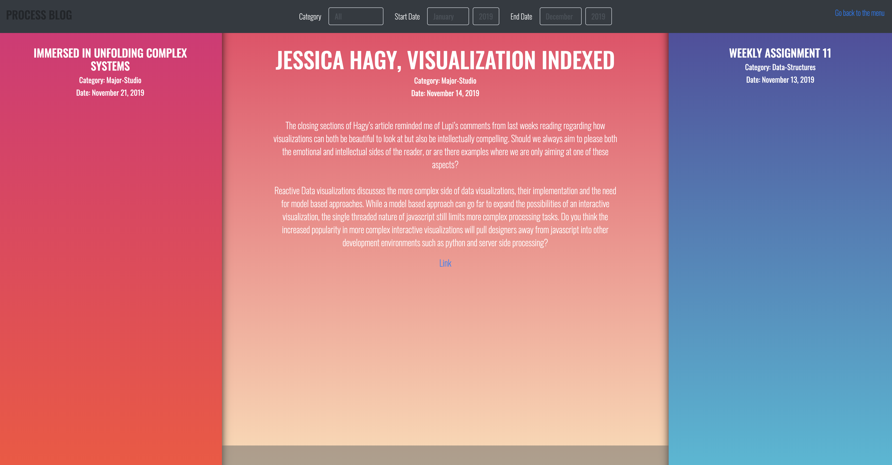

## Final Assignment 2
# Blog

Details of the Assignment can be found [here](https://github.com/visualizedata/data-structures/blob/master/final_assignment_2.md).  

Details of the process building up to the final assignment can be found in the 
[Week5](https://github.com/neil-oliver/data-structures/tree/master/week05), 
[Week6](https://github.com/neil-oliver/data-structures/tree/master/week06), 
[Week10](https://github.com/neil-oliver/data-structures/tree/master/week10) & 
[Week11](https://github.com/neil-oliver/data-structures/tree/master/week11) Folders. 


## Endpoints
An endpoint was created using node express but is not directly accessed by the user.
The user is served a static HTML page and an AJAX call is made using JQuery to request data from the endpoint. 
```javascript
function getResults(){
    
    $.get( '/blog',parameters, function(data) {
    ...
    });
}

function init(){
    getResults()
}
```
The response from the endpoint contains HTML formatted data via handlebars.
This information is then loaded into the HTML using jQuery.
  
### Handlebars
Once the query has completed, the handlebars module is used to format the response from the query into an array of HTML elements. 
Handlebars first loads an external file (with a .HTML extension to provide syntax highlighting during creation).
```html
{{#blogpost}}
  <div class="col-xs-4">
    <div class='post'>
      <h1>{{title}}</h1>
      <h2>Category: {{category}}</h2>
      <h3>Date: {{created}}</h3>
      <p>{{content}}</p>  
      <a href='{{link}}' target="_blank">Link</a>
    </div>
    <div id='expandpanel'></div>
  </div>
{{/blogpost}}
```
  
### Response handling
Unlike the use of handlebars in [Final Assignment 1](https://github.com/neil-oliver/data-structures/tree/master/final1), the information can not be directly mapped from the query response to the handlebars template variables object.
Due to the nested objects within the DynamoDB response, the response has to be looped through and a new object created and appended to the handlebars template variables array.
Moment is used to format the date as text as it is not used for calculation, but only for display on each blog post. 
```javascript
var output = {};
output.blogpost = [];

function onScan(err, data) {
    if (err) {
        console.error("Unable to scan the table. Error JSON:", JSON.stringify(err, null, 2));
        throw(err);
    } else {
        console.log("Scan succeeded.");
        
        data.Items.sort(function(a,b){
          return new Date(b.created.S) - new Date(a.created.S);
        });
        
        data.Items.forEach(function(item) {
             console.log("***** ***** ***** ***** ***** \n", item);
             output.blogpost.push({'title':item.title.S, 'content':item.content.S, 'category':item.category.S,'created':moment(item.created.S).format('LL'), 'link': item.link.S});
         });
        fs.readFile('./blog-handlebars.html', 'utf8', (error, data) => {
            var template = handlebars.compile(data);
            var html = template(output);
            resolve(html);
        });
    }
};
```

## Filtering
Default values are in place so that if no variables are contained within the AJAX call, a default search can still be made.
```javascript
minMonth = minMonth || "January";
maxMonth = maxMonth || "December";
minYear = minYear || "2019";
maxYear = maxYear || "2019";
category = category || 'all';

```
### Category Filtering
Filtering by category is done via a query. 
The default or user selected parameters (category, start and end date) are inserted into the query string and a query is made. 

```javascript
if (category != 'all'){
    var params = {
        TableName : "process-blog",
        KeyConditionExpression: "category = :categoryName and created between :minDate and :maxDate", // the query expression
        ExpressionAttributeValues: { // the query values
            ":categoryName": {S: category},
            ":minDate": {S: new Date(minDate).toISOString()},
            ":maxDate": {S: new Date(maxDate).toISOString()}
        }
    };
    
    dynamodb.query(params, onScan)
}
```
The default view for the webpage requires all of the categories to be displayed. As both the partition key and sort key cannot be provided it is not possible to create a dynamoDB query.
Therefore a scan is carried out that does not provide the category name (partition key), but does still provide filtering based on the creation date.
While a scan is computationally expensive, the performance in testing was not noticably affected. To ensure the best performance, a scan is only carried out when all categories are required, otherwise a query is used.
```javascript
if (category == 'all'){
    var params = {
        TableName: "process-blog",
        ProjectionExpression: "created, category, content, title, link",
        FilterExpression: "created between :minDate and :maxDate",
         ExpressionAttributeValues: { // the query values
            ":minDate": {S: new Date(minDate).toISOString()},
            ":maxDate": {S: new Date(maxDate).toISOString()}
        }
    };
    
    dynamodb.scan(params, onScan)
}
```
### Time Filtering
With the user being able to specify both a start and end date to filter the blog posts, a validity check was needed to ensure that the user has specified a start date that is before the end date.
After each selection in the browser, the start and end dates are checked and the selections are updated. The start month and year will always take priority in the selection.
```javascript
$('select').change(function() {
    if (parseInt($('select[name="end"]').val()) < parseInt($('select[name="start"]').val())){
        $('select[name="end"]').val($('select[name="start"]').val())
    }
    if (parseInt($('select[name="start"]').val()) > parseInt($('select[name="end"]').val())){
        $('select[name="start"]').val($('select[name="end"]').val())
    }
    if (parseInt($('select[name="end-year"]').val()) < parseInt($('select[name="start-year"]').val())){
        $('select[name="end-year"]').val($('select[name="start-year"]').val())
    }
    if (parseInt($('select[name="start-year"]').val()) > parseInt($('select[name="end-year"]').val())){
        $('select[name="start-year"]').val($('select[name="end-year"]').val())
    }
});
```
  
As the user is not providing a whole date in their selection, the paramters have to be combined and a date created.
```javascript
var minDate = minMonth+' 1,'+minYear
var maxDate = maxMonth+' 1,'+maxYear
```
## Fontend Design
### Custom Design
A custom horizontal scroll design was created for the blog that allows for both a summary information view and full content view without the need for additional pages or layouts.
When the user selects any of the posts it will expand to show the full content and also increase the font sizes to focus the users attention. The design is responsive and mobile friendly. 
 
### Default Values
On page load, the three selection boxes are set based on the current month and year.
The year selection box is dynamically populated to ensure that ther user can continue to make a full selection of all blog posts in the future.

```javascript
function init(){
    $(`select[name="start"]`).val(01)
    $(`select[name="end"]`).val(new Date().getMonth()+1)
    
    $(`select[name="startyear"]`).val(2019)
    $(`select[name="endyear"]`).val(new Date().getYear()+1900)
    
    //build month dropdown
    var currentyear = new Date().getYear()
    currentyear += 1900
    for (var i=2018; i<currentyear;i++){
        $('select[name="start-year"]').append(`<option value="${i+1}">${i+1}</option>`) 
        $('select[name="end-year"]').append(`<option value="${i+1}">${i+1}</option>`) 
    }
}
```

## Data Entry
To assist with data entry of the blog posts to the DynamoDB database, a custom form was created which used to add blog posts to the database via express ```POST```.
More details can be found in the [Week 5 Documentation](https://github.com/neil-oliver/data-structures/tree/master/week05).
```html
<!DOCTYPE html>
<html>
    <head>
        <title>Progress Blog Admin Page</title>
        <style>
            input, textarea {width : 50%;}
        </style>
    </head>
    <body>
        <form action="/" method="POST">
            Author<br>
            <input type="text" value="Admin" name="author"><br>
            Title<br>
            <input type="text" name="title" placeholder="required"><br>
            Category<br>
            <input type="text" name="category" placeholder="Required"><br>
            Content<br>
            <textarea name="content" rows="10"></textarea><br>
            Images<br>
            <input type="text" name="images" placeholder="Optional"><br>
            Tags<br>
            <input type="text" name="tags" placeholder="Optional"><br>
            How are you feeling?<br>
            <input type="text" name="emotion" placeholder="Optional"><br>
            What are you doing?<br>
            <input type="text" name="activity" placeholder="Optional"><br>
            What are you eating?<br>
            <input type="text" name="food" placeholder="Optional"><br>
            Publish &nbsp;
            <input type="checkbox" name="published"><br>
            <input type="submit">
        </form>
    </body>
</html>
```
The custom entry form made an easy user interface for adding blog posts. However due to hosting the application on AWS cloud 9, the process of accessing the data entry form was slightly time consuming and not optomised for mobile.
For this reason a custom importer was also written to handle bulk data entry via CSV file. 
```javascript
fs.createReadStream('Blog-posts.csv')
  .pipe(csv())
  .on('data', (row) => {
    console.log(row);
    
    // construct the blog post using the data
    // reminder: constructor(category, created, title, author, content, tags published, tags, images, emotion, activity, food) 
    var post = new BlogEntry(row.Category, moment(row.Created).toISOString(), row.Title, row.Author, row.Content, row.Link, true, [row.Tags], [row.Images], row.Emotions, row.Activity, [row.Food]);
    console.log(post)
    // set up putItem for DynamoDB
    var params = {};
    params.Item = post; 
    params.TableName = "process-blog";
    var reply='';
    
    // attempt to save the information and display a message on success or error
    dynamodb.putItem(params, function (err, data) {
    
    if (err != null){console.log(err)}
    
    });
    
  })
  .on('end', () => {
    console.log('CSV file successfully processed');
  });
```

## Variation from original design
### Date filtering
In the original front end and query design, the user provded a full date as a filter. 
While this does offer a more accurate search, the number of blog entries (even considering possible future growth) would not be high in a month period and therefore the accuracy would not be a large benefit.
In addition to the small amount of added value, date pickers can be problematic when considering cross browser compatibility. For these reasons the filtering was reduced to month and year.
### Front End Design
The overall design was changed from a more tranditional full post and card based layout that has been made popular through frameworks such as wordpress and bootstrap.
While the original design would have worked it would have required the design of multiple views and pages and may have possibly felt sparsly populated due to the shorter style of the process blog posts.
The current design is more suited to the content and does not need the additional views. The animation to the expanded view helps keeping object constancy and provides a quicker navigation than the previous design.