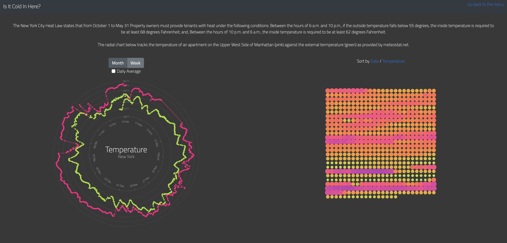
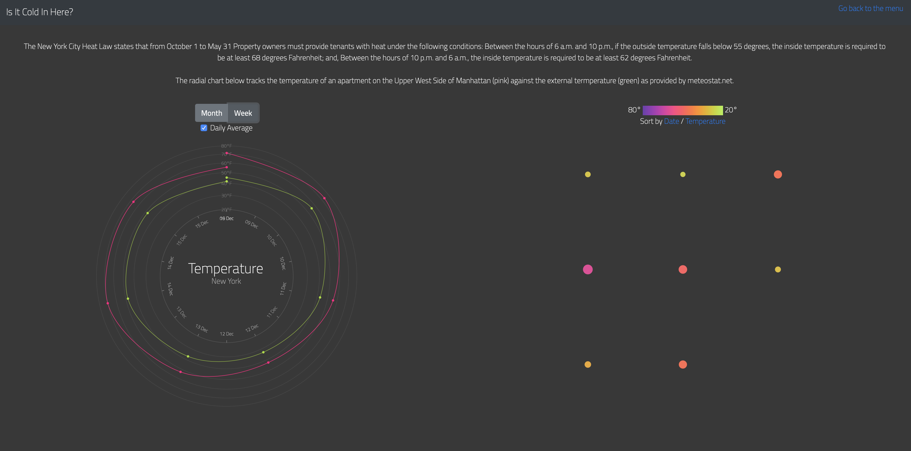

## Final Assignment 3
# Temperature Sensor

Details of the Assignment can be found [here](https://github.com/visualizedata/data-structures/blob/master/final_assignment_3.md).  

Details of the process building up to the final assignment can be found in the 
[Week9](https://github.com/neil-oliver/data-structures/tree/master/week09), 
[Week10](https://github.com/neil-oliver/data-structures/tree/master/week10) & 
[Week11](https://github.com/neil-oliver/data-structures/tree/master/week11) Folders. 



## Endpoints
An endpoint was created using node express but is not directly accessed by the user.
The user is served a static HTML page and an AJAX call is made using JQuery to request data from the endpoint. 
```javascript
function getResults(){
    
    $.get( '/temperature',parameters, function(data) {
    ...
    });
}

function init(){
    getResults()
}
```
The response from the endpoint contains JSON formatted data..
This information parsed and reformatted before being used to draw two graphs using ```.D3```.

## Database Query & Design
Once the endpoint is called an asynchronous function is called to make a request to the database. 
The function is passed the parameters that were part of the AJAX call.
```javascript
app.get('/temperature', async function (req, res) {
    if (req.query == {}){
        res.send(await temperature());
    } else {
        res.send(await temperature(req.query.period));
    }
});
```
The temerature data from the partical sensor is being recorded every 5 minutes. Querying and retreiving all values to the browser is easily possile without any noticable delay due to the maximum 30 day period allowed through the visualization.
However the visualization contains points used for a tooltip and displaying every 5 minute value does not add a lot of value to the user but does cause the interface to become overly cluttered.
This reason, combined with the external data only being available in hourly increments infomed the choice to query the data based on an hourly average value.
```javascript
`SELECT
EXTRACT (YEAR FROM sensortime) as sensorYear,
EXTRACT (MONTH FROM sensortime) as sensorMonth, 
EXTRACT (DAY FROM sensortime) as sensorDay,
EXTRACT (HOUR FROM sensortime) as sensorHour, 
AVG(sensorValue::int) as temp_value
FROM newSensorData
GROUP BY sensorYear, sensorMonth, sensorDay, sensorHour
ORDER BY sensorYear, sensorMonth, sensorDay, sensorHour;`;
```

The query also has a date filter applied to it which is passed the current time and a value 30 days prior that is created using [moment JS](https://momentjs.com/). The query will always request the past 30 days however it is setup to be able to handle additional time periods for flexibility in the future.
```javascript
period = period || 'Month'

var start;
var end = new Date().toISOString();

// check if either a week or month has been selected and use moment to create the correct from date.
if (period == 'Month'){
    start = moment(end).subtract(30, 'days').format();
} else {
    start = moment(end).subtract(7, 'days').format();
}
        
`WITH newSensorData as (SELECT * FROM sensorData WHERE sensortime BETWEEN timestamp '${start}' AND timestamp '${end}')`
```
### Query Response
```javascript
0: {sensoryear: 2019, sensormonth: 11, sensorday: 15, sensorhour: 4, temp_value: "50.5000000000000000"}
1: {sensoryear: 2019, sensormonth: 11, sensorday: 15, sensorhour: 5, temp_value: "51.1666666666666667"}
2: {sensoryear: 2019, sensormonth: 11, sensorday: 15, sensorhour: 6, temp_value: "48.2500000000000000"}
3: {sensoryear: 2019, sensormonth: 11, sensorday: 15, sensorhour: 7, temp_value: "48.9166666666666667"}
4: {sensoryear: 2019, sensormonth: 11, sensorday: 15, sensorhour: 8, temp_value: "47.8333333333333333"}
5: {sensoryear: 2019, sensormonth: 11, sensorday: 15, sensorhour: 9, temp_value: "46.5833333333333333"}
```

## Frontend Design
Two graphs were created to visualize the temperature data. 
Firstly a radial clock allows a clear comparison between the internal and external temperature.
The simple buttons allow the user to filter the data between month and week (without requerying the data) or view as a daily average.
The additional 'dots' visualization only visualises the sensor data. While this does display the same information as the radial chart, its alternative form factor allows easier compaison of trends and temperature movement in comparison to the radial form.


## Frontend Data Manipulation
As the hourly averaged data is being retrieved as the default view it would be inneficient to requery the database to filter the data.
Therefore filtering by time and by daily average for both the sensor data and the external weather data are both dealt with in javascript.
Time filtering is dealt with on any selection change and reformatting of data including createing date/time objects are dealt with within the D3 ```draw()``` function.

### Filtering by time


```javascript
$(function(){
    $("input, label").on("click", function(){
      if ($(this).attr('id') == 'Week'){
        //filter data using moment
        data = dbData.filter(d => moment(parseNewDate(d.sensoryear + '-' + d.sensormonth + '-' + d.sensorday + 'T' + d.sensorhour)).isAfter(weekAgo));
        sortWeatherData('Week');
      } else if ($(this).attr('id') == 'Month'){
        //reset data
        data = dbData;
        sortWeatherData('Month');
      } else if ($('#Week').hasClass("active")){
        //do this for the checked box
        data = dbData.filter(d => moment(parseNewDate(d.sensoryear + '-' + d.sensormonth + '-' + d.sensorday + 'T' + d.sensorhour)).isAfter(weekAgo));
        sortWeatherData('Week');
      } else if ($('#Month').hasClass("active")){
        data = dbData;
        sortWeatherData('Month')
      }
      draw()
      drawDots()

    });
});
```

### Creating Daily Averages & reformatting data
Reformatting the data from the external data source and the database query allows the use of D3's built in ```scaleTime```. 
This is beneficial to ensure that all date points are aligned between the two data sources and any missing data does not disrupt the correct positioning of data points.
```javascript
if ($('#gridCheck').is(":checked") == true ){

    formatter = d3.timeFormat("%Y-%m-%d");
    parser = d3.timeParse("%Y-%m-%d")
    
    data = d3.nest()
      .key(function(d) { return formatter(parseNewDate(d.sensoryear + '-' + d.sensormonth + '-' + d.sensorday + 'T' + d.sensorhour));})
        .rollup(function(d) { 
        return d3.mean(d, function(g) {return g.temp_value; });
    }).entries(data);

} else {

    formatter = d3.timeFormat("%Y-%m-%dT%H:%M:%S.%LZ");
    parser = d3.timeParse("%Y-%m-%dT%H:%M:%S.%LZ")
    
    data = d3.nest()
      .key(function(d) { return formatter(parseNewDate(d.sensoryear + '-' + d.sensormonth + '-' + d.sensorday + 'T' + d.sensorhour));})
        .rollup(function(d) { 
        return d3.mean(d, function(g) {return g.temp_value; });
    }).entries(data);

}
```

#### Reformatted data structure
```javascript
0: {key: "2019-11-15T04:00:00.000Z", value: 50.333333333333336}
1: {key: "2019-11-15T05:00:00.000Z", value: 51.166666666666664}
2: {key: "2019-11-15T06:00:00.000Z", value: 48.25}
3: {key: "2019-11-15T07:00:00.000Z", value: 48.916666666666664}
4: {key: "2019-11-15T08:00:00.000Z", value: 47.833333333333336}
5: {key: "2019-11-15T09:00:00.000Z", value: 46.583333333333336}
```

#### Data Structure for Dots Visualization
A different data structure is required to allow for the animated filtering in the dots visualization. This is called and updated on each selection change based on the data structures described above.
```javascript
var data2 = data.map(function(d){
    return {id:d.key, size:1+colorScale(d.value)*9 , color: 1-colorScale(d.value) }
  })
```
The resulting data format.
```javascript
0: {id: "2019-11-15T04:00:00.000Z", size: 5.827272727272727, color: 0.4636363636363636, x: 0, y: 0}
1: {id: "2019-11-15T05:00:00.000Z", size: 5.718181818181819, color: 0.4757575757575757, x: 16, y: 0}
2: {id: "2019-11-15T06:00:00.000Z", size: 6.195454545454545, color: 0.42272727272727273, x: 32, y: 0}
3: {id: "2019-11-15T07:00:00.000Z", size: 6.086363636363637, color: 0.4348484848484848, x: 48, y: 0}
4: {id: "2019-11-15T08:00:00.000Z", size: 6.263636363636363, color: 0.41515151515151527, x: 64, y: 0}
5: {id: "2019-11-15T09:00:00.000Z", size: 6.468181818181818, color: 0.39242424242424245, x: 80, y: 0}
```
### External Weather Data
Along with reformatting the data structure of the external data to match the database query, the data also needeed to be converting from celcius to fahrenheit.
```javascript
var monthWeather;

function getWeatherData(){
  
  var start = monthAgo.format('Y-M-D')
  var end = moment(now).format('Y-M-D')
  
  // make a request to meteostat for historical weather data
  var baseURL = `https://api.meteostat.net/v1/history/hourly?station=72503&start=${start}&end=${end}&time_zone=America/New_York&time_format=Y-m-d%20H:i&key=qMMTpKxL`

  $.get(baseURL, function(dta){
    monthWeather = dta.data.map(function(d){
      //make new object to match the database data and convert from celcius to fahrenheit 
      return {key:moment(d.time).toISOString(), value:d.temperature * 9 / 5 + 32}
    })
    weatherData = monthWeather

    draw();
    drawDots();

  });
}
```
Moment.js is used as a browser plugin to allow for easy filtering of the external data to either 7 days or 30 days.
```javascript
function sortWeatherData(period){
  
  var start;
  
  if (period == 'Week') {
    weatherData = monthWeather.filter(d => moment(d.key).isAfter(weekAgo));
  } else {
    weatherData = monthWeather
  }
  
}
```

