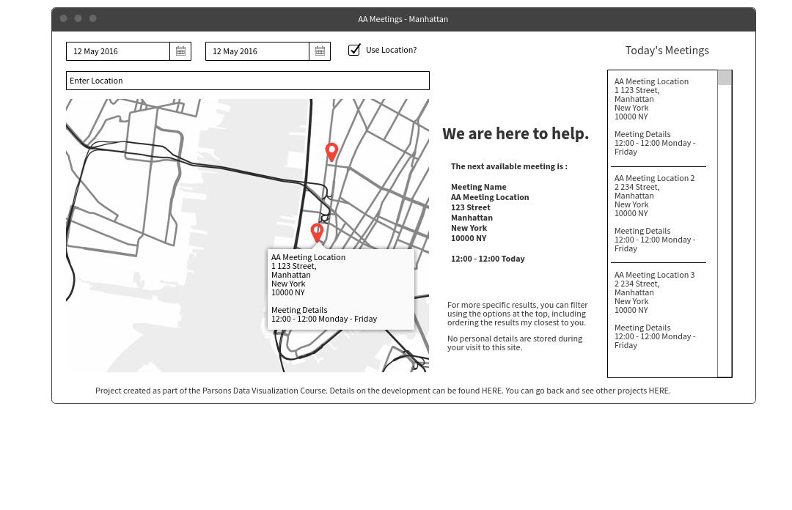
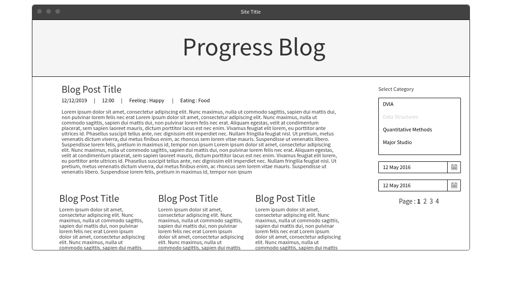
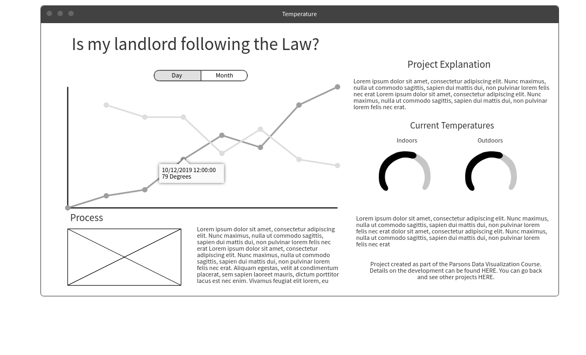

# Weekly Assignment 11
Task instructions provided by [Aaron Hill](https://github.com/aaronxhill).

Full instructions for this tasks can be found on the Parsons MSDV [Data Structures GitHub Page](https://github.com/visualizedata/data-structures/blob/master/weekly_assignment_11.md).

A description of the technical implementation of the design aspects (discussed below) can be found in the [Week 10](https://github.com/neil-oliver/data-structures/tree/master/week10) folder.

The front end design for all three projects will be implemented using [Bootstrap](https://getbootstrap.com) to assist with form components and responsive design.

## AA

#### What will the visualization look like? Will it be interactive? If so, how?
- Large map of manhattan taking up around 50 % of the screen space. 
- Mapbox [Light/Dark theme](https://www.mapbox.com/maps/light-dark/) (switching at night) 
- List of events on right hand side.
- Search criteria at the top.
- A large welcome message with the next available meeting listed underneath. 
- Interaction - Tooltip showing user friendly directions. Link to google maps for directions to venue.

#### How will the data need to be mapped to the visual elements? 
- Pins on map showing location of each meeting. 
- Currently selected meeting has a different color pin.
- Tool tips showing additional information.

#### For that mapping, what needs to be done to the data? Be specific and clear. Will it require filtering, aggregation, restructuring, and/or something else? How will this be done? 
- Filtering by day, start and end time.
- Sorting by distance (not required). Disclaimer about no data tracking.
- Distance based on user search using the TAMU API to get latitude / longitude.
- Possible distance based extension: resort based on user clicking a point on the map.
- Meetings aggregated to location so that multiple location pins do not get placed on the map.

#### What is the default view (if any)?
- Map of all of manhattan. 
- All of the available meetings for the rest of day.
- List of meetings sorted by time.

#### What assumptions are you making about the user?
English speaking user within close proximity / familiarity with New York.
- Potential need for quick result 
- Potential need for anonymity.
- Ease and speed of information is more important that an interactive / design.
  
  
## Process Blog

#### What will the visualization look like? Will it be interactive? If so, how?  
- Title and short introduction at the top
- Links on the right hand side for category, time periods (month / week)
- Selection for custom time period on the side.
- Most recent blog for the selected category or time period is large at the top with additional stories smaller with a summary underneath.
- Clicking on one of the 'smaller' posts will exand the layout so that the full post can be read. 
Additional pages will not have the introduction and large banner heading and all blog posts will be displayed in full.

#### How will the data need to be mapped to the visual elements? 
- text based representation. 
- emoji replacement of text based emotions ( ;) )
- Drop down menus for sleection of time periods and categories.

#### For that mapping, what needs to be done to the data? Be specific and clear. Will it require filtering, aggregation, restructuring, and/or something else? How will this be done?  
- Filtering on time & category
- Sort by date / time
- results limit per page - either 4 (1 large 3 small) or 7 (one large 6 small) on the front page.

#### What is the default view (if any)?
- Latest blog post from any category. Smaller blog posts are from all categories.

#### What assumptions are you making about the user?
- English speaking user.
- No requirement to have prior knowledge of the course.

  
## Temperature Sensor

#### What will the visualization look like? Will it be interactive? If so, how?
- Introduction to the project and the New York City heat laws.
- Line graph showing the temperature from the sensor & external temperature data provided by the [National Digital Forecast Database](https://www.nws.noaa.gov/mdl/survey/pgb_survey/dev/rest.php).
- Image and explanation of the process of creating the proton sensor and where it is located in order to collect the data.
- Tool tip to show details when hovering over data points on the graph. 

#### How will the data need to be mapped to the visual elements? 
- Both internal and external temperature mapped on the same graph.
- X axis = Time, Y axis = Temperature.
- Line at 50 degrees fahrenheit.
- Color change below 50 degrees.

#### For that mapping, what needs to be done to the data? Be specific and clear. Will it require filtering, aggregation, restructuring, and/or something else? How will this be done?
- Data from the sensor needs to be averaged to per hour due to the National Digital Forecast Database data only being available per hour.
- Changeable time period from one month to one week. Graph will change based on filtering the data client side so that additional database calls are not needed.
- Ability to see avergage temperatures for each day instead of per hour.

#### What is the default view (if any)?
- Graph showing every data point recorded over the past 30 days.

#### What assumptions are you making about the user?
- They understand fahrenheit! (details of the coversion could be included in the description).
